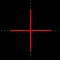

| [Main Page](../../../docs.md) | [How To Use](../usage.md) | [Preparing a Map](maps_tutorial.md)

# VIPRA Map Tutorial
How to prepare a .dxf file for implementation with VIPRA

### Table of Contents
> [Background](#background)  
[File Type](#file-type)  
[Size](#size)   
[Origin](#origin)   
[Layers](#layers)   
\- [Removing Excess Layers](#removing-excess-layers)   
\- [Moving Obstacles to One Layer](#moving-obstacles-to-one-layer)   
[Creating Spawns](#creating-spawns)   
[Objectives](#objectives)   
[Areas](#areas)   
[Troubleshooting Guide](#troubleshooting-guide)  
[More Information](#more-info)   

# Background
The VIPRA simulator uses a coordinate system to define entities within its simulation, both physical and nonphysical. These coordinates are combined to form 2D geometric figures to define space. There are four different types of geometry that VIPRA uses to define space:

- **Obstacles:** Anything physical that can block an agent's movement in a direction.
- **Spawns:** An area that defines where agents can be created within at the start of the simulation.
- **Objectives:** Points of interest. Goals for agents to move towards. 
- **Areas:** Geometry that defines spaces that have the potential to change agent behavior.

When importing a map, there typically is not a way for VIPRA to immediately discern what geometry is of which type. A rectangle in a doorway could be an obstacle, as it may represent a closed door. Alternatively, it could represent an exit, and therefore an objective. It may also be an area, changing the way an agent may behave as it moves through a doorway. Since there is no way for the program to know what a polygon should be just by looking at a set of points, a user must define these spaces for VIPRA. 

VIPRA includes a **.dxf input module** to parse geometry from. A .dxf file is a neutral-format 3D Computer-Aided Design (CAD) file type. Many CAD programs that output blueprints can export vector drawings in the form of .dxf files. 

The way VIPRA parses a .dxf file to know which set of geometrical figures is an obstacle, spawn area, objective, or area, is through layers. Most CAD programs provide multi-level categorization in which geometry can be organized within. VIPRA utilizes these layers and their names to also organize geometry into their different types. 

All obstacles are placed into one layer called "obstacles". All spawn areas are placed into their own single layer called "spawns". All areas are placed into one or more layers with the prefix "areas_" appended to the front. Objectives consist of any other layer added to the project. When added, objectives will be referenced by the name of the layer they are in. 

This document provides detailed instruction on how to prepare your .dxf file in [LibreCAD](https://librecad.org/), a free CAD software tool, but any 2D CAD tool, such as [AutoCAD](https://www.autodesk.com/products/autocad/overview) that supports export in the .dxf format and utilizes layers is acceptable. 

In the above example, you can see the obstacles layer in cyan, the spawns layer in yellow, the exit objective layer shown on the map in red, and an area called "slippery" in magenta. This is a simple example, but all input .dxf files should have similar organization.

# File Type

While .dxf is a common file type, .dwg is even more common. LibreCAD can technically import .dwg files, but it does not have full support. It is recommended that .dwg files go through an online converter to change the type to .dxf. While there is not one in particular that we endorse, there are many options out there such as [CloudConvert](https://cloudconvert.com/cad-converter).

# Size
VIPRA uses meters as its standard unit. The coordinate of (1,3) means the point is 1 meter to the right and 3 meters up from the origin. When exporting as a .dxf, VIPRA receives no context regarding the size. Therefore, in order to make sure that the file is up to scale, it is important to use the measure and scale tools to fit the map to the right size.

In LibreCAD, the current units can be changed under Options -> Application Preferences and then under the Defaults tab, there is a section for "Defaults for new drawings" with a dropdown next to "Unit" for the current unit. Make sure this is set to "Meters".

If you are unsure of what units your current map is drawn in, you can use the measurement tool to measure an area of which you know the size. For example, a standard US doorway is roughly 30 inches wide. Using the Measure tool, if you measured a door frame and found that it was 30 units wide, it is most likely in inches. However, if it is roughly 0.75 units wide, the map was drawn in meters. 

To use the measure tool in LibreCAD, click on the Measure tool in the left-hand toolbar and then click "Point-to-Point".

Next, use the corner snapping method (set of icons at the bottom of the screen) to select the corners of geometry that you know the width of. 

The result in units is displayed on the right-hand side in the console. 

To actually scale up a map, first make sure that all layers are visible. In LibreCAD, this is demonstrated with the eye symbol next to each layer. If the eye is greyed out, it is hidden. To toggle it back on, simply click on the eye. 

Use `Ctrl` + `a` to select all or go to Select -> Select All using the lefthand sidebar. This will make sure that all geometry is highlighted for scaling and moving. 

Next, select Modify in the left-hand sidebar and select the Scale tool. Select a point in which to scale from. This point will remain in the same position before and after the scaling. Usually, it is recommended to select the origin as the point of scaling.

When prompted, select "Delete Original", "Isotropic Scaling", and use a factor in which you are scaling from. "Use Current Layer" should not be selected, as the geometry across all layers will be scaled.

Scale by a factor that converts the current scale to meters. For example, if the map is currently in inches, then to scale this to meters, you would scale by a factor of 0.0254.

Once complete, hit `Ctrl` + `k` to deselect everything.

# Origin
All coordinates in the file should be above (0,0). VIPRA only uses positive real number coordinates during simulation. 

   

In LibreCAD, the origin is represented by a red  `+` in the center of the workspace. If your geometry falls below or to the left of that red `+` at any point, it may cause issues for the simulation. To fix this, go to Modify and select Move/Copy. Utilize the different snap options to best place your map within the upper-right quadrant. Be sure to select "Delete Original" and deselect "Use Current Layer" if you are moving the entire map.

# Layers

## Removing Excess Layers
Often in blueprints, extra information is included to help builders understand the layout of the floorplan. This can be room labels, measurements, or a doors' ranges of motion. This information, while helpful for builders, may be obstructive if the program things they are barriers. It would be bad if agents were running into the word "kitchen" as if it were a wall!

In LibreCAD, removing an item is easy as going to the Select icon, then clicking Select Entity. 

Hit `Ctrl` + `k` to first deselect all and then select the geometry you wish to remove. Once everything is selected, press the `Del` key on the keyboard. 

If all excess information is on one layer, you can also delete the layer by selecting the layer in Layer panel and pressing the `-` button above to delete it, or right-clicking it and pressing "remove layer".

⚠️**BE CAREFUL**⚠️

This action ***CANNOT*** be undone once you remove the layer. 

**Note:** Layer 0 is a default layer in LibreCAD and cannot be removed or renamed. It is important to move everything out of this layer before importing the map file. 

## Moving Obstacles to One Layer
Everything that an agent can collide with should be moved to one layer and renamed "obstacles". This can include walls, locked doors, furniture, anything solid that would get in the way of an agent's path. 

First, we need to create an obstacles layer. To do this, you can either press the `+` button in the Layer List and make the name "obstacles" when prompted. Alternatively, if there is already a layer with most or all of the obstacles in it (that isn't layer 0), you can rename this layer to "obstacles" by right-clicking the layer and selecting "Edit Layer Attributes" or select the layer and select the pen button at the top of the Layer List.

Next, we need to move all obstacles onto one layer. To start, deselect everything (`Ctrl` + `k`). Next, lock all layers that **don't** have obstacles that you wish to include in the simulation. You can lock layers by selecting the lock icon next to the layer in the Layer List. 

Select all remaining geometry, which should include all of your obstacles (`Ctrl` + `a`). In the lefthand sidebar, select "Modify" then "Attributes". 

Next, be sure "Apply attributes Block-deep" is checked and from the dropdown list in the pop-out menu, select the newly created "obstacles". Select OK. 

Now, all geometry should be on one layer. [Delete the excess layers](#removing-excess-layers). 

# Creating Spawns
Creating areas in which to create agents for simulation is as simple as drawing on new geometry. Now that you know how to [add a new layer](#moving-obstacles-to-one-layer), create a new layer and name it "spawns". 

Now, using any geometry tool (I will use the rectangle tool in this example), add geometry to your map where agents should spawn. 

In this example, I have created a single box in yellow for agents to spawn in. 

(Floor plan provided by [Free CAD Floorplans](https://freecadfloorplans.com/call-center-offices-412202/))

For more information on how to use LibreCAD Drawing Tools, follow the link [here](https://docs.librecad.org/en/2.2.0_a/ref/fundamentals.html). 

For a simple box, click on the line tool (Top icon in the left-hand sidebar), and then select the rectangle tool. With the spawns layer selected, click in the workspace where you would like to place one corner of the rectangle. Then, click another place to place the other corner of the rectangle.

If your cursor is snapping to the wrong points, turn off [snapping tools](https://docs.librecad.org/en/latest/ref/snaps.html) to give yourself room to place your geometry.

# Objectives
Agents will need objectives to have an idea of where to move to. Objectives, like spawns, have no collisions with other pieces of geometry. 

There can be multiple objectives in a map. Each objective type should be on its own layer and named something different. These layers can be named anything with standard alphanumeric characters, so long as it does not share its name with spawns or objectives, and does not start with "areas_".

To avoid issues with naming, be sure multiple layers do not have the same name. Layer names are **case-insensitive**, meaning if you have one layer named "Bathrooms" and another named "bathrooms" this could cause an issue in the system, as both layers would be named the same thing. 

**Note:** When drawing objectives, **be sure** that they do not intersect with other geometry. 

In the above  example, the green exit layer is an objective layer. These layers do not touch other parts of geometry.

# Areas
Some situations may require an agent to change directions, slow down, or even stop for a few seconds in an area. These areas cannot be so easily defined by any of the other layer types mentioned above. To define the geometry of these types of areas, simply add new geometry on a new layer, and begin the layer's name with "areas_". Again, this name is **case-insensitive** so both Areas_ and AREAS_ are also valid. 

For example, say we wanted a new area that represented a museum display. Entering the area may have agents slow down as they pass by. To represent this, you may draw a box to define the area and call it "AREAS_Museum_Display." The actual behavior will be defined within [Behaviors](../behaviors/behaviors_syntax.md#location-target-modifier).

# Troubleshooting Guide
## "No path found for pedestrian..."
When you receieve this error, it means that a path from an agent to an objective could not be made. This is likely caused by either incorrect geometry or objective points being placed too close to obstacles.

To fix this try the following:  

1. **Be sure that the endGoalType matches at least one of the objective layer names.** The module_parms.json file is where to specify the initial end goal for agents to move towards. This end goal can be updated throughout the simulation, but must be specified at the start or there will be no end goal. 

2. **Check to make sure a clear path is possible.** Be sure that there are no obstructions blocking agents from the objective. Obstructions can come in the form of objectives being placed in impossible-to-navigate corridoors, objectives being placed past areas too narrow for agents, and agents or objectives being placed inside of obstacles. 

3. **Be sure that the closestObstacle value is not too high.** Higher values may treat walls like they're larger than they should be. You can fix this by changing the `closestObstacle` value under "AStar" in your module_params.json file to a smaller decimal value. If you are not using AStar, see the troubleshooting guide for the respective module. 

# More Info
For more tutorials on how to use LibreCAD, visit [here](https://wiki.librecad.org/index.php?title=Tutorials).